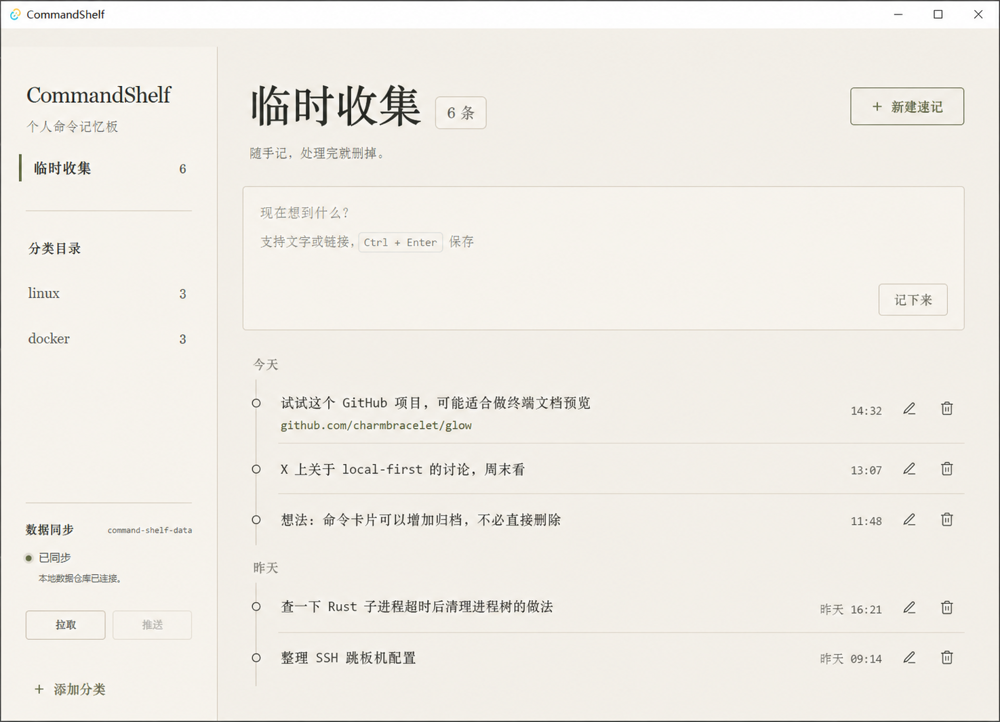

# 临时收集页开发计划

## 1. 当前状态

- 本文只记录后续开发计划，不代表功能已经实现。
- 已选定“速记纸条流”方案：侧边栏固定首项进入临时收集页，页面以时间流展示文字和链接。
- 本次在当前电脑尝试了第一个原子，但因缺少可用的 Windows Rust 编译环境而停止；相关源码改动已撤销，没有提交或推送半成品。
- 后续开发应在装有 Rust、MSVC C++ Build Tools、WebView2、Git for Windows 和 Node.js 的 Windows 电脑上进行。

## 2. 设计参考

下图是后续界面实现的视觉基准。实现时沿用现有 CommandShelf 的纸感底色、衬线标题、橄榄色强调、细分隔线和克制按钮，不重新设计整套视觉语言。



### 界面约束

- 左侧栏第一项固定为“临时收集”，位于“分类目录”之前，不属于用户可编辑分类。
- 固定项显示当前记录数量；选中时沿用现有分类的橄榄色左侧指示线。
- 主标题为“临时收集”，说明文字为“随手记，处理完就删掉。”。
- 顶部只保留一个主要动作“新建速记”，不显示“问 Codex”和“按次数排序”。
- 录入区使用单个多行输入框，允许普通文字、链接或两者混合。
- 支持 `Ctrl + Enter` 保存；按钮文案为“记下来”。
- 内容按文件中的数组顺序展示，默认新记录插入顶部。
- 时间流按“今天”“昨天”和更早日期分组；每条记录显示内容、时间、编辑和删除入口。
- 链接只是内容的一部分，不要求用户选择类型；界面可识别并以链接样式展示，但不得额外保存网页元数据。
- 删除前必须确认；处理完成后直接删除，不增加归档状态。
- 最小窗口、键盘焦点和同步期间禁用规则继续沿用现有应用。

### 明确不包含

- 搜索、标签、筛选、置顶、收藏、归档和批量操作。
- 网页标题抓取、链接预览、X 或 GitHub API。
- 后台同步、自动拉取、冲突合并和应用内 GitHub 登录。
- Codex 生成临时内容、命令执行或其他 AI 提供方。

## 3. 数据设计

数据仓库根目录新增独立文件 `inbox.json`，与 `commands.json` 一起由现有 Git 仓库同步。第一版建议格式：

```json
{
  "schemaVersion": 1,
  "items": [
    {
      "id": "inbox-550e8400-e29b-41d4-a716-446655440000",
      "content": "周末看看这个项目\nhttps://github.com/charmbracelet/glow",
      "createdAt": "2026-07-14T06:32:00.000Z",
      "updatedAt": "2026-07-14T06:32:00.000Z"
    }
  ]
}
```

字段规则：

- `schemaVersion`：固定为整数 `1`。
- `items`：有序数组；数组顺序就是界面顺序。
- `id`：非空且文档内唯一，正式保存时生成稳定 UUID。
- `content`：非空文本，允许换行和链接，不拆分标题、备注或链接类型。
- `createdAt`：首次保存时生成的 UTC ISO 8601 时间文本。
- `updatedAt`：最近一次编辑时更新；首次保存时与 `createdAt` 相同。
- 文件上限为 10 MB，必须是 UTF-8。
- 保存格式统一使用两空格缩进、LF 和结尾换行。
- 加载时拒绝未知版本、重复 ID、空内容和空时间字段。
- 无效文件不得被空文档覆盖；保存前必须检查文件哈希基线，防止覆盖应用外修改。
- 首次进入临时收集页且文件不存在时创建空文档；已存在文件绝不由初始化流程替换。

## 4. 产品交付单元

### UNIT-01 随手保存一条临时内容

- 用户价值：用户可以把文字或链接立即记下，并在重启后继续看到。
- 触发与前置条件：已连接有效数据仓库，进入“临时收集”。
- 预期结果：内容保存到 `inbox.json` 顶部，界面数量和同步状态同步更新。
- 验收场景：输入纯文字、纯链接、文字加链接并保存；重启后内容、顺序和时间仍正确。
- 明确不包含：编辑、删除、Git 远端同步。

### UNIT-02 修改一条临时内容

- 用户价值：用户可以纠正或补充已经记录的内容。
- 触发与前置条件：目标记录存在，当前没有保存或 Git 同步操作。
- 预期结果：保留原 ID 和创建时间，更新内容与 `updatedAt`。
- 验收场景：编辑后立即显示新内容；重启后修改仍存在；保存失败时恢复原内容。
- 明确不包含：新增、删除和排序。
- 依赖：UNIT-01。

### UNIT-03 删除一条已处理内容

- 用户价值：处理完成的临时内容可以从速记流中移除。
- 触发与前置条件：目标记录存在，用户确认删除。
- 预期结果：记录从 `inbox.json` 和界面中移除；失败时恢复原记录和焦点。
- 验收场景：取消确认不改变数据；确认后重启仍保持删除结果。
- 明确不包含：归档、回收站和批量删除。
- 依赖：UNIT-01。

### UNIT-04 在多台电脑间同步临时内容

- 用户价值：用户通过现有“拉取/推送”在多台电脑间同步临时内容。
- 触发与前置条件：仓库具有 `origin`、当前分支和上游；本地数据有效。
- 预期结果：拉取会校验并加载 `commands.json` 与 `inbox.json`；推送只暂存并提交这两个受管文件。
- 验收场景：新增、编辑或删除后推送，另一克隆拉取后得到相同内容；远端无 `inbox.json` 的旧仓库仍可兼容初始化。
- 明确不包含：强推、自动合并、冲突解决和其他文件提交。
- 依赖：UNIT-01；后端同步支持应在前端开始创建 `inbox.json` 前完成，避免暂时破坏现有推送。

## 5. 开发前置核查

换到新电脑后先执行，不修改代码：

```powershell
git status -sb
git remote -v
git branch -vv
Get-Command cargo, rustc, node, git
Get-Command link.exe -ErrorAction SilentlyContinue
cargo fmt --manifest-path src-tauri\Cargo.toml --check
cargo test --manifest-path src-tauri\Cargo.toml --all-targets
cargo clippy --manifest-path src-tauri\Cargo.toml --all-targets -- -D warnings
node --check scripts\desktop-smoke.mjs
node scripts\复制无刷新回归.mjs
```

重点核查 Rust 最低版本：当前维护指南写的是 Rust `1.77.2`，但本次临时环境使用该版本读取现有锁定依赖时，`idna_adapter 1.2.2` 因使用 `edition2024` 清单而无法被 Cargo 1.77.2 解析。新电脑应先复现并判断：

1. 如果正式开发环境的既有缓存或锁文件能够在 1.77.2 下完整通过，保留现有最低版本说明。
2. 如果稳定复现依赖不兼容，先单独建立一个环境兼容原子：优先把传递依赖锁定到仍支持 1.77.2 的版本；确实无法保持时，再明确评估并更新最低 Rust 版本及相关说明。
3. 环境兼容问题未解决前，不开始临时收集功能，也不提交无法验证的功能代码。

## 6. 原子任务计划

以下顺序优先保证每个提交都能构建、验证和独立回退。每个原子完成后执行针对性检查、审查完整 diff、只暂存本原子文件、创建中文提交并推送；下一台电脑的开发会话仍需再次确认远端推送授权。

### ATOM-01 读取并初始化临时收集文档

- 唯一目标：已配置仓库可通过受控 Tauri 入口在阻塞线程池中读取或按需初始化合法的 `inbox.json`，并返回文档哈希。
- 可观察变化：合法文档可往返读写；首次读取创建空文件；再次读取保留原内容；未知版本、重复 ID、空内容和超限文件返回稳定错误。
- 允许修改：`model.rs`、新增独立存储模块、`app_service.rs`、`lib.rs` 和对应单元测试。
- 明确不修改：保存、备份、Git 同步和前端。
- 验证方式：存储模块校验/序列化测试、服务层初始化/重载/无配置/无效文件测试、`cargo fmt --check`、全部 Rust 测试和 Clippy。
- 计划提交信息：`支持读取临时收集文档`。

### ATOM-02 安全保存临时收集文档

- 唯一目标：使用最近哈希保护基线，备份后原子替换 `inbox.json`。
- 可观察变化：合法修改可保存并返回新哈希；外部文件变化、备份失败或写入失败时不覆盖原文件。
- 允许修改：应用服务、备份模块、Tauri 保存入口和对应测试。
- 明确不修改：前端新增/编辑/删除和 Git 同步。
- 验证方式：保存成功、基线变化、备份、原子写入和重启恢复测试。
- 依赖：ATOM-01。
- 计划提交信息：`支持安全保存临时收集文档`。

### ATOM-03 将 inbox.json 纳入 Git 同步

- 唯一目标：现有拉取、状态判断和推送把 `commands.json` 与 `inbox.json` 作为唯一受管数据文件。
- 可观察变化：任一文件变化都会显示本地有修改；推送只暂存两个文件；拉取前校验远端候选；旧远端缺少 `inbox.json` 时保持兼容。
- 允许修改：`git_repository.rs`、`app_service.rs` 及 Git 集成测试。
- 明确不修改：界面、后台同步、自动合并和强推。
- 验证方式：正常拉取/推送、远端领先、本地未提交、无效远端 inbox、无关文件、身份/网络/拒绝和超时测试。
- 依赖：ATOM-01、ATOM-02。
- 计划提交信息：`同步临时收集数据文件`。

### ATOM-04 展示固定入口与速记时间流

- 唯一目标：用户可以从侧边栏固定首项进入只读临时收集页并看到已有记录。
- 可观察变化：固定入口、数量、标题、日期分组、时间线、空状态和链接样式与参考图一致；分类页保持原行为。
- 允许修改：`frontend/index.html` 和临时收集前端回归脚本。
- 明确不修改：新增、编辑、删除行为。
- 验证方式：前端语法、固定入口导航、记录渲染、空状态、分类往返、最小窗口和 1024×768/1440×1024 截图检查。
- 依赖：ATOM-01、ATOM-03。
- 计划提交信息：`添加临时收集页面`。

### ATOM-05 新增一条临时记录

- 唯一目标：输入内容后保存为时间流顶部的新记录。
- 可观察变化：空白输入被拒绝；按钮和 `Ctrl + Enter` 均可保存；成功后清空输入、更新数量和同步状态；失败时恢复界面数据。
- 允许修改：临时收集页新增交互及对应回归测试。
- 明确不修改：编辑和删除。
- 验证方式：纯文字、链接、混合内容、连续保存、保存失败回滚、同步期间禁用和重启恢复。
- 依赖：ATOM-02、ATOM-04。
- 计划提交信息：`支持新增临时记录`。

### ATOM-06 编辑一条临时记录

- 唯一目标：已有记录可进入编辑状态并保存修改。
- 可观察变化：保留 ID 与 `createdAt`，只更新内容和 `updatedAt`；取消不写文件；失败恢复原内容和焦点。
- 允许修改：编辑交互及对应回归测试。
- 明确不修改：删除、排序和归档。
- 验证方式：保存、取消、空白内容、失败回滚、Escape 返回和焦点恢复。
- 依赖：ATOM-05。
- 计划提交信息：`支持编辑临时记录`。

### ATOM-07 删除一条临时记录

- 唯一目标：用户确认后删除指定记录。
- 可观察变化：取消确认无变化；确认后数量和日期分组更新；保存失败恢复记录、顺序和焦点。
- 允许修改：删除交互及对应回归测试。
- 明确不修改：回收站、归档和批量删除。
- 验证方式：确认/取消、删除分组最后一条、删除全部、失败回滚和重启恢复。
- 依赖：ATOM-05。
- 计划提交信息：`支持删除临时记录`。

## 7. ATOM-01 已尝试实现记录

本节只用于下次优先复核，不表示这些代码仍在工作区。当前电脑上的源码改动已全部撤销。

### 曾经修改的内容

- 在 `model.rs` 中增加：
  - `InboxEntry`：`id`、`content`、`createdAt`、`updatedAt`。
  - `InboxDocument`：`schemaVersion`、有序 `items`。
  - `InboxSnapshot`：文档、SHA-256、是否本次初始化空文件。
- 新建 `inbox_store.rs`，曾实现：
  - 最大 10 MB 检查。
  - UTF-8、JSON、版本、必填字段和重复 ID 校验。
  - 两空格缩进、LF、结尾换行序列化。
  - 不覆盖已有文件的空文档初始化。
  - 稳定错误码：`INBOX_NOT_FOUND`、`INBOX_READ_FAILED`、`INBOX_TOO_LARGE`、`INBOX_INVALID`、`INBOX_UNSUPPORTED_SCHEMA`、`INBOX_SERIALIZE_FAILED`、`INBOX_ALREADY_EXISTS`。
- 在 `app_service.rs` 中增加了按需读取/初始化 `inbox.json` 的服务方法。
- 在 `lib.rs` 中把阻塞任务帮助函数泛型化，并注册过 `load_inbox_document` Tauri 命令。

### 曾经编写的验证点

- 空文档初始化后可重新加载，哈希为 64 位十六进制文本。
- 拒绝未知 `schemaVersion`。
- 拒绝重复记录 ID。
- 拒绝纯空白内容。
- 序列化字段名稳定、包含结尾换行并可完整读回。
- 服务层首次读取创建 `inbox.json`，第二次读取不再初始化且哈希保持一致。

### 当前电脑上的验证结果

- `cargo fmt --check`：通过。
- Rust 单元测试：未能运行完成，不能视为通过。
- 第一次失败：Rust/Cargo 1.77.2 无法解析现有锁定依赖 `idna_adapter 1.2.2` 的 `edition2024` 清单。
- 第二次失败：改用稳定 Rust 1.97.0 后，系统缺少 MSVC `link.exe` 和 Visual C++ Build Tools，依赖构建阶段停止。
- Git：没有创建提交，没有推送；半成品源码已撤销。

### 下次优先验证顺序

1. 先完成“开发前置核查”，确认基线项目在新电脑可完整测试。
2. 按 ATOM-01 的边界重新实现数据模型、存储、服务和受控 Tauri 读取入口，不加入保存、同步或前端代码。
3. 先运行存储模块针对性测试，再运行全部 Rust 测试和 Clippy。
4. 检查完整 diff，确认所有新增公共类型、字段、函数和关键规则均有中文注释。
5. 只有验证全部通过后才提交并推送 ATOM-01，然后进入 ATOM-02。

## 8. 最终验收

所有原子完成后至少执行：

```powershell
cargo fmt --manifest-path src-tauri\Cargo.toml --check
cargo test --manifest-path src-tauri\Cargo.toml --all-targets
cargo clippy --manifest-path src-tauri\Cargo.toml --all-targets -- -D warnings
node --check scripts\desktop-smoke.mjs
node scripts\复制无刷新回归.mjs
node scripts\临时收集回归.mjs
```

还需人工检查：

- 1440×1024、1024×768 和最小窗口没有横向溢出，长内容可纵向滚动。
- 侧边栏固定项始终排在分类之前，分类新增、选择和命令操作不回归。
- 输入区、编辑和删除确认具备清晰焦点圈；Escape 和保存后焦点返回合理位置。
- 同步期间禁止新增、编辑和删除，但仍可浏览内容和复制链接。
- 拉取无效远端数据时保留当前可用命令与临时记录。
- 安装、启动、推送、另一克隆拉取、卸载后数据仓库保留。

全部通过后再运行：

```powershell
pwsh -ExecutionPolicy Bypass -File scripts\release-candidate.ps1
```

发布时核对独立 EXE、安装包、版本、架构、体积和 SHA-256，并更新项目说明与安装使用说明中的数据文件、同步范围、测试数量和安装包信息。
